Mariana Rivera Pérez - Sistema de Gestión de Estudiantes

BASE DE DATOS CREADA EN PRIMSA.IO

CONGIGURACION DE LA BASE DE DATOS EN PRISMA.IO

CONEXION POR CONSOLA
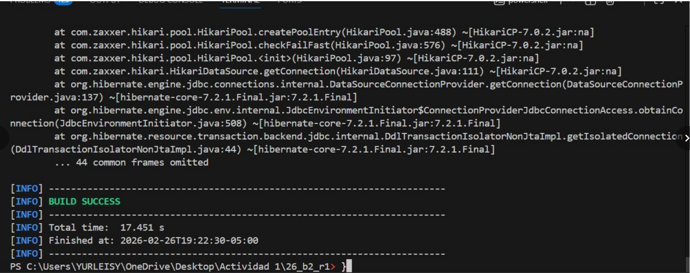
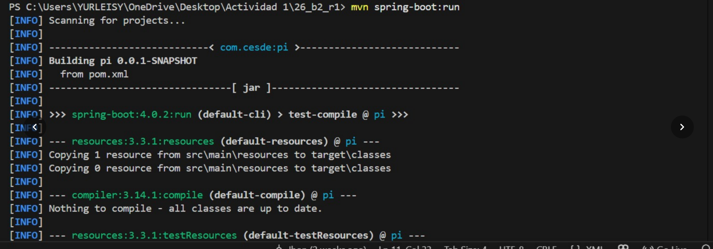
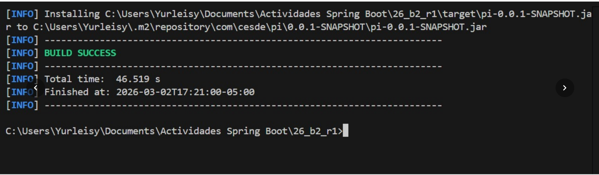
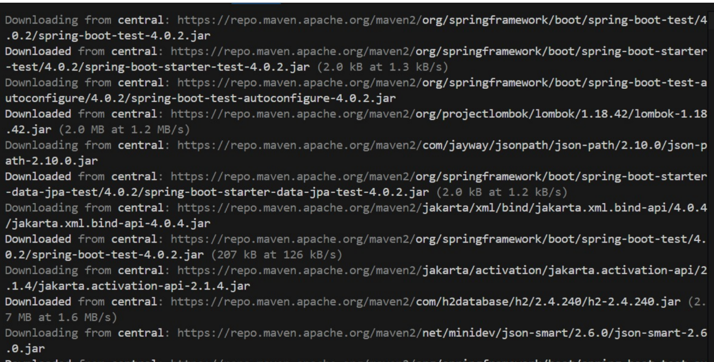
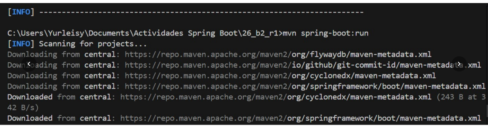
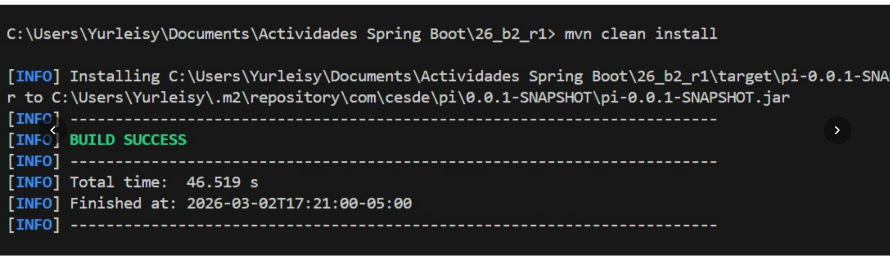
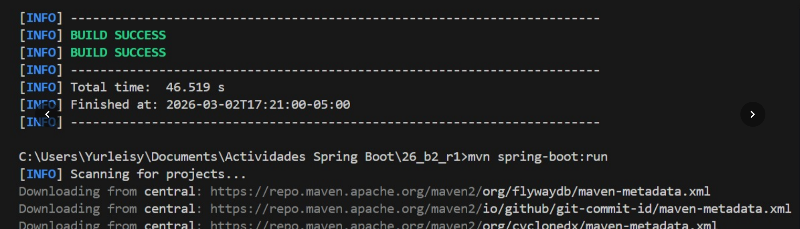

EVIDENCIAS DE LA API (CRUD)
Esrudiante1

Estudiante2
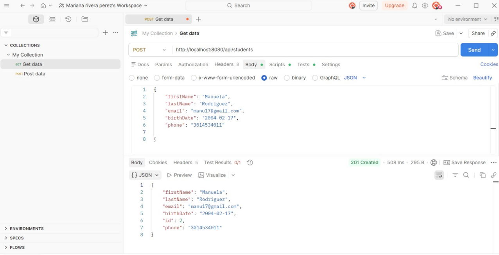
Estudiante3
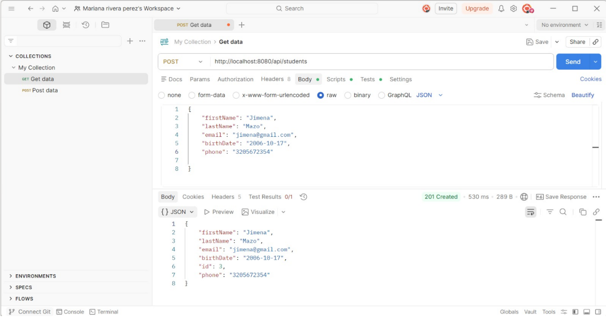
GET ALL
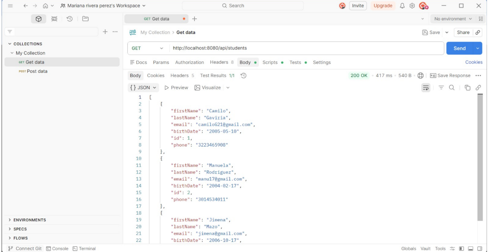
PRUEBA EN PRISM.IO
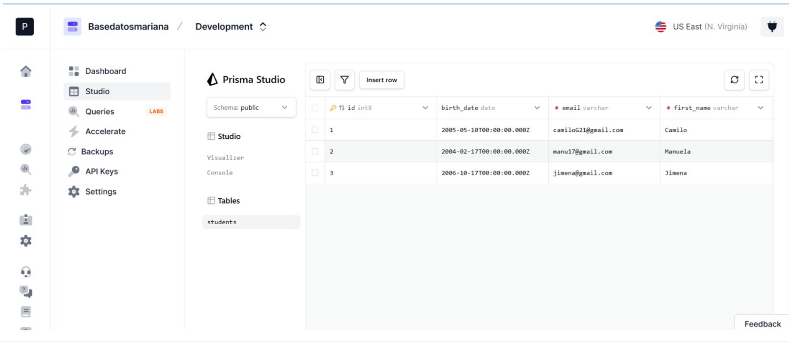
PRUEBA GET BY ID 

GET BY EMAIL
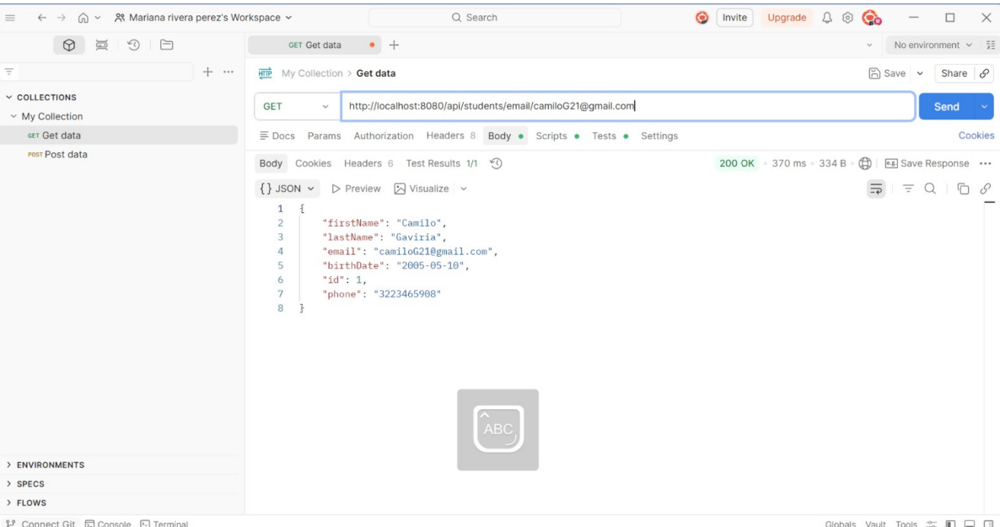
 PUT 
 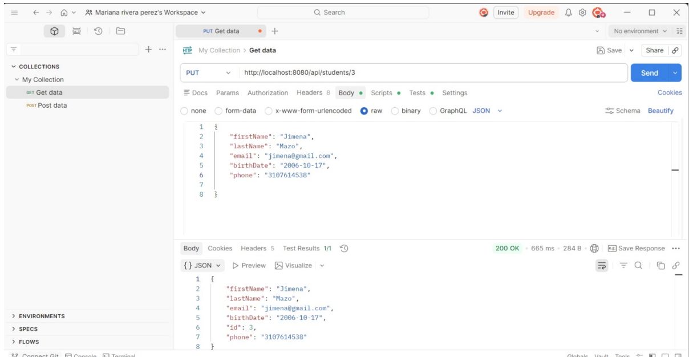
 DELET
 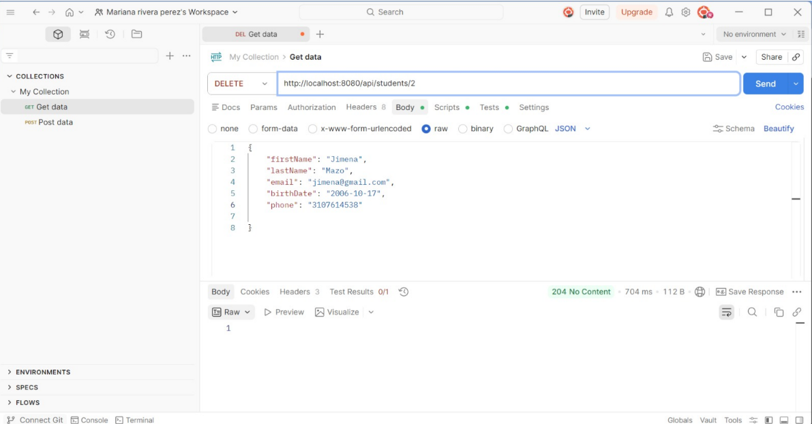
